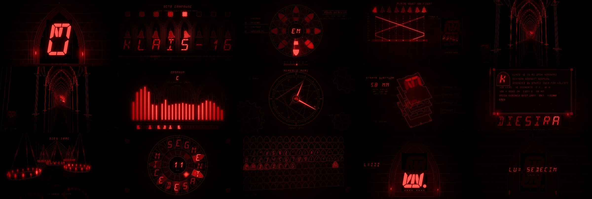

# KLAIS-16 — two music videos

**Two generated music videos for [openKolibri/klais-16](https://github.com/openKolibri/klais-16)** — the open-hardware
16-segment LED display. Both are about two minutes at 1080p, and everything in them — the music, the picture and the encode — is
generated by code in this repo: nothing is hand-animated, nothing is sampled (except a tiny robot voice in the first one).

| | **SIXTEEN** — the Bauhaus edition | **LUX SEDECIM** — the gothic edition |
| --- | --- | --- |
| File | [`dist/klais16-bauhaus.mp4`](dist/klais16-bauhaus.mp4) — 1:58 · 47 MB | [`dist/klais16-gothic.mp4`](dist/klais16-gothic.mp4) — 2:02 · 38 MB |
| Look | flat Bauhaus primaries on black: circles, half-discs, bars, a construction grid | **red and black only** — pointed arches, rose windows, candles, bells, an organ, engraved plates |
| Sound | 132 BPM, F phrygian, dark techno with a robot voice | 128 BPM, E harmonic minor, gothic techno — **instrumental, no voices** |
| Idea | a bar has **16 steps**, the display has **16 segments** — the display *is* the sequencer | **change ringing**: 16 rows × 8 bells = **128 strikes = the 128 LEDs** of the board |
| Loudness | −14 LUFS | −14 LUFS |




## Everything is taken from the real project

Nothing is a lookalike; both videos are driven by the data in the klais-16 repo:

| On screen / in the track | Comes from |
| --- | --- |
| The 17 segment shapes, the board outline with its connector notches, six screws, mounting holes | KiCad files (`pcb/*/*.kicad_pcb`, layer `Edge.Cuts`), parsed by `tools/extract-geometry.mjs` |
| All **128 LEDs at their true PCB positions** and which segment each one belongs to | `pcb/…-L0.kicad_pcb` + `firmware/include/segmentMapping.h` (every LED lands inside the polygon of its own segment — the script checks) |
| Every glyph | the firmware's own ASCII table `firmware/include/sixteenSegments.h` (MIT, © 2017 David Madison) |
| **The daisy chain**: each byte pushes the byte a module holds on to the next module; all displays latch together after a pause | how `firmware/src/main.c` really works (RX/TX interrupts + the "timeout refresh") — the title *"KLAIS-16"* is sent in reverse so it reads correctly once shifted through 8 modules |
| **UART frames** (8N1, LSB first, 115200 baud) | README §UART; in the Bauhaus edition the same bitstream is the *rhythm of the blips you hear* — every `1` bit is a ping, one bit per 16th note |
| TM1640 scan: 16 grids × 8 lines, `GRID = (REF-1)/8+1`, `SEG = (REF-1)%8` | README §LED Number. In the gothic edition this is the score: **row *r* of the ring is grid *r+1*, bell *b* is line *b*** — and on the board the 16 grids really are 16 regions (grids 1–2 are the top bars A and B, grid 16 is the underline) |
| Brightness codes `0x88…0x8F`, segment-mode `0x11 DC1 + 3 bytes`, baud-select pads | README §Firmware |
| The exploded **PCB stack** L0–L3, 5.8 mm, 63.97 g, 100 × 66.66 mm | README §Design / §PCB Stack (layer geometry from the KiCad files) |
| 128 LEDs, 16 segments, 5 V, 1.6 W, licences, part numbers | README |
| The three title words `SIXTEEN` / `SEGMENT` / `DISPLAY`, all exactly seven letters | README header art |
| The "inverted" cells (letter cut out of a lit block) | a nod to the README's `Todo: implement inverted font` |
| The printable ASCII table, 32–127 | the firmware font (the gothic edition shows the whole 7-bit table: **128 codes = 128 LEDs**) |

The **Kolibri bird artwork is deliberately not used** in either video: the klais-16 README says it is a trademark that may not be reproduced in derivative works.

---

# Edition 1 — SIXTEEN (Bauhaus)

▶ **[`dist/klais16-bauhaus.mp4`](dist/klais16-bauhaus.mp4)** — 1:58 · 1920×1080 @ 30 fps · H.264 + AAC · 47 MB · −14 LUFS

## The idea

A techno bar has **16 sixteenth-note steps**. The display has **16 segments**. So the display *is* the sequencer:
step *i* lights segment *i* (firmware order `A B C D E F G H K M N P R S T U`). Every drum and bass pattern in the track is a
16-step grid, and on screen the kick, hats, acid line and stabs each play a colourway of the product
(`SEG-16-RED / YEL / BLU / WHT-MDNT`, straight from the part-number table) segment by segment.

The look is Bauhaus: flat primaries, circles / half-discs / triangles / bars, rulers, a construction grid, type as image — on the
black MDNT face, with the product's own LED colourways (`RED YEL BLU GRN WHT`) as the palette and a little bloom because LEDs glow.

## The track

132 BPM, F phrygian/minor, 64 bars (+ a bar of ring-out), synthesised from scratch in plain JavaScript — no samples, no DAW
(`src/audio/`): kick with two-stage pitch glide, a reverb-tail *rumble* bass sidechained to the kick, a TB-303-style acid line
through a nonlinear ladder filter, 909-style hats, claps, polyrhythmic ticks (every 5th step), toms (every 7th), FM clanks
(every 3rd), dub-techno chord stabs into a ping-pong echo, pads, risers, an FDN reverb, bus compression and a look-ahead limiter,
mastered to −14 LUFS with a −1.5 dBFS ceiling. Layers on top:

* **The UART layer** — `KLAIS-16 SIXTEEN SEGMENT DISPLAY` as 10-bit frames, one bit per 16th note, pitched by bit position.
  `KLAIS-16` is exactly 80 bits = 5 bars.
* **The boot chirps** — in bar 1 each of the 16 sixteenth-notes plays a rising blip *as its segment lights up* (the self-test).
* **A robot voice** (eSpeak NG formant synthesis) chanting the README's title words, timed to the on-screen typing in the build and
  to the rows of the wall in the drop.

The synthesiser is deterministic (seeded noise), so every render is bit-identical. It also writes a **cue sheet**
(`build/cues.json`: every drum hit, note, blip and vocal syllable, plus a 24-band spectrum every 1/60 s) that the renderer reads —
that is how the picture is locked to the music.

## Structure

| Bars | Time | Scene | What happens |
| ---: | ---: | --- | --- |
| 0–3 | 0:00 | **boot** | one module powers up; underline LEDs, DP; the 16-segment self-test (one chirp = one segment); mask register `0x0000→0xFFFF`; brightness ladder `0x88→0x8F`; `0x81` OFF |
| 3–6 | 0:05 | **chain** | 8 modules power up, bytes shift through the chain, *timeout*, **all modules latch on the downbeat of bar 4** as the kick enters — `KLAIS-16` |
| 6–8 | 0:11 | **scan** | the 128 LEDs at their real positions + the 16×8 multiplex mosaic, one grid per 16th, double speed in the last bar |
| 8–12 | 0:15 | **ascii** | huge glyph + the live UART waveform of the byte being transmitted (the blips you hear) |
| 12–16 | 0:22 | **words** | `SIXTEEN`, `SEGMENT`, `DISPLAY` typed one letter per step (the voice says each as it lands); bar 15 is the riser, the last step a blackout |
| 16–20 | 0:29 | **wall** | drop — an 8×3 wall of modules edge to edge, letters coloured by flat Bauhaus fields |
| 20–24 | 0:36 | **kaleido** | `KLAIS-16` as a ring of glyphs snapping 22.5° per beat |
| 24–28 | 0:44 | **sequencer** | four colourways, four instruments, one segment per step |
| 28–32 | 0:51 | **tunnel** | fly through a corridor of panels; speed ramps with the riser |
| 32–40 | 0:58 | **stack** | breakdown — the four-board PCB sandwich explodes; the arpeggio chases around the segments; UART sparks race between the edge connectors; it slams shut on the snare roll |
| 40–44 | 1:13 | **table** | drop 2 — the whole printable ASCII set, 16 × 6 panels, ripples on every kick |
| 44–48 | 1:20 | **wall** | marquee + inverted cells |
| 48–52 | 1:27 | **array** | a 14 × 4 array in real perspective, swinging camera (the repo's `isoArray` photo, alive) |
| 52–56 | 1:34 | **tunnel** | faster, twisted the other way |
| 56–60 | 1:42 | **poster** | the spec sheet as a Mondrian/Bauhaus poster |
| 60–64 | 1:49 | **url** | the URL pushed through the chain one byte per eighth note; the last 8 characters are, of course, `KLAIS-16` |
| 64 | 1:56 | **end** | the array holds `KLAIS-16.`, the decimal points blink, power down |

Between scenes there are Bauhaus wipes (slabs, iris, checkerboard, bars); the big impacts (bars 8, 16, 40, 56) are hard cuts with a shockwave ring.

---

# Edition 2 — LUX SEDECIM (gothic)

▶ **[`dist/klais16-gothic.mp4`](dist/klais16-gothic.mp4)** — 2:02 · 1920×1080 @ 30 fps · H.264 + AAC · 38 MB · −14 LUFS

## The brief, and the idea

The LEDs on the board are red (KT-0603R), so the second edition is **red and black and nothing else** — no colour, **no vocals** —
and gothic instead of Bauhaus: pointed arches, rose windows, candles, bells, a pipe organ, stone, engraving, Latin inscriptions,
all drawn in the display's own segment font. It is not a recolour: the ideas are new, and they all grow from the numbers of the board.

**Change ringing.** Eight bells ring *plain hunt on eight*: every bell rings once per row, and neighbours swap places, so the
order changes each row until, after 2 × 8 = **16 rows**, the bells come round to rounds again. That is 16 × 8 = **128 strikes** —
one for each LED on the module — and the 16 rows are the 16 TM1640 grids of the driver (8 LEDs each), the 8 bells the 8 lines of a
grid. The other coincidences are real too, and the video leans on all of them:

| Number | Where it turns up |
| --- | --- |
| **8** | modules in the daisy chain = the characters of `KLAIS-16` = bells in the ring = letters of `DIES IRAE` = notes of its first phrase |
| **16** | segments = steps of a bar = rows of a course = petals of the rose windows = characters of `SEDECIM SEGMENTA` = divisions of the clock |
| **128** | LEDs = strikes of a course = codes of 7-bit ASCII = the number the tenebrae count down from |

The story is the number: the display is lit segment by segment (*fiat lux*), the ring lights the board grid by grid in the first
drop, the third course spells the phrase around a rose, the fourth lights the ASCII table in reading order — and the last course
**snuffs the 128 LEDs one by one**, top of the board first, until only the great bell is left.

## The track

128 BPM, **E harmonic minor** (E F♯ G A B C D♯), 64 bars + a bar of ring-out (2:02), instrumental — nothing sampled, and nothing that
sounds like a human voice (no formant filters, no choir). Synthesised in plain JavaScript like the first one
(`src/audio/voices-gothic.mjs`, `song-gothic.mjs`, `render-audio-gothic.mjs`):

* **The ring** — eight tuned handbells (bell partials: hum, prime, tierce, quint, nominal … as inharmonic sines with split modes
  so they shimmer) ring plain hunt from `src/shared/ring.js`, the same table the picture uses. The pitches follow the chord
  (Em7 · Cmaj7 · Am7 · B7 — the B chord carries the raised seventh, D♯). *Ringing up* in the intro (tenor first, one more bell
  per bar), then five **courses**: one row per bar in drop 1, two rows per bar in the requiem and drop 2, and in the last eight bars the
  course whose 128 strikes each snuff an LED.
* **The great bell** tolls on E and B (a church bell: 11 inharmonic partials, ~9 s ring); reversed bells swell into the drops.
* **Pipe organ** — additive wavetable with drawbar stops, tremulant and breath chiff: long chords, and dub-style stabs into a dotted-eighth ping-pong echo.
* **A reed lead** and a celesta play the **Dies irae** — the 13th-century plainchant (public domain), first phrase transposed to E:
  E D♯ E B C B A B. It fits E harmonic minor exactly (D♯ is the leading tone), and it has eight notes.
* **Techno underneath**: a kick tuned to E1 (41 Hz) with a reverb-tail *rumble* sidechained to it, an EBM-style rolling bass through the ladder
  filter, a **gated-reverb snare** (the darkwave sound), chains rattled onto stone as the hats (bouncing-and-settling impulse trains), a
  five-step clock tick, seven-step war drums, three-step iron clanks, heartbeats in the requiem, fire crackle in the intro and outro, a
  snuffed-candle breath on every strike of the last course, and a cathedral reverb (6.5 s) plus a hall on top of it all.
* The master is −14 LUFS with a −1.5 dBFS ceiling, and the same **cue sheet** as before (`build/gothic/cues.json`): every strike carries its
  row, bell and LED number, so the picture can light exactly the LED that was struck.

## Structure

| Bars | Time | Scene | What happens |
| ---: | ---: | --- | --- |
| 0–3 | 0:00 | **fiat lux** | darkness, the great bell, two candles are lit; bar 1: the 16 segments ignite one per sixteenth (a celesta note each), bar 2: `F I A T` on the beats while the 8 underline LEDs ring rounds, bar 3: the full stop, `L U X`, the flare |
| 4–7 | 0:07 | **belfry** | eight lancet windows, a bell over each module; the bells are *rung up* (tenor first) and the letters of `KLAIS-16` appear as they sound; the daisy chain is a real chain along the sill and every strike sends a light along it |
| 8–11 | 0:15 | **rosa** | the 16-step sequencer as a rose window: one turn of the beam = one bar; rings for bells, chains, kick and the drifting five-step tick; the hub names the chord |
| 12–15 | 0:22 | **plain hunt** | the build: the score of the method appears one row per beat while the bells still ring rounds; each row lights the 8 LEDs of one grid on the module; `16 × 8 = 128`; the last step is a blackout |
| 16–23 | 0:30 | **nave** | drop 1 — a wireframe gothic nave flown through in perspective (mirror floor, LED beads on the arches); every kick sends a wave down the ribs; at the far end a rose window whose petals light one per bar (the rows of course A — eight of its sixteen in this scene) while the board in the corner fills with light |
| 24–27 | 0:45 | **organum** | the pipe organ is the spectrum analyser: 24 pipes = 24 bands, each an LED column; the keys of the console press the chord that sounds |
| 28–31 | 0:52 | **horologium** | a clock with 16 divisions: one hand per bar, the five-step ticks and seven-step drums each jump a hand and draw the star polygons {16/5} and {16/7}; gears turn a tooth per tick |
| 32–35 | 1:00 | **strata** | the requiem: the four boards of the PCB stack explode, drawn as an engraving; the second course lights the LEDs and light climbs through the cut-outs; the stack slams shut |
| 36–39 | 1:07 | **codex** | a manuscript page in candlelight — the facts of the project in the segment font, an illuminated `K` — and eight modules that spell `DIES IRAE`, one letter per celesta note |
| 40–43 | 1:15 | **chandeliers** | drop 2 — five coronas of 16 candles swing on their chains, reflected in the floor; the reed plays the Dies irae and the far coronas light the candle of each note |
| 44–47 | 1:22 | **rosa II** | `SEDECIM SEGMENTA`: sixteen characters in sixteen petals, the window snaps 22.5° per beat, and the third course rings the letters — an anagram machine |
| 48–55 | 1:30 | **ossarium** | the ASCII table as a wall of 128 niches, lit in reading order by the fourth course (control codes named, `BEL` included); the Dies irae wakes `D I E S I R A E` |
| 56–63 | 1:45 | **tenebrae** | the opening framing again, but the last course **snuffs the 128 LEDs** one per strike, top of the board first, a wisp of smoke rising from each; the counter falls in Roman numerals; the candles gutter and die |
| 64 | 1:57 | **end** | the great bell; `LUX SEDECIM`; black |

Between scenes there are a portcullis, a pointed-arch iris and closing curtains; the big impacts (bars 16, 40, 56) are hard cuts with a thin shock ring.

## How it stays red

Scenes only ever draw in the **red channel** ("tone levels" 0–1); the last step of every frame maps that one channel through a single
ramp — black → deep crimson → LED red → a slightly pale hot core, like an over-driven red LED — see `src/gothic/tone.js`. The bloom is additive red,
there is no RGB split, and whatever a scene does, no other hue can reach the screen. `tools/red-check.mjs` decodes the finished file and confirms it:
every non-black pixel of the sampled frames lies within −20…+15° of pure red (0 outside; the encode is H.264 4:2:0 with extra chroma bits, because a red picture lives in its chroma).

## Run it yourself

Requirements: Node ≥ 20.12, [Playwright](https://playwright.dev) (`npm install` — uses headless Chromium), and an `ffmpeg` with libx264 + AAC
(`FFMPEG=/path/to/ffmpeg` to override). Optional: eSpeak NG only if you want to regenerate the voice samples of the first edition.

```sh
npm install
KLAIS16=/path/to/klais-16 npm run geometry   # optional: re-extract geometry + font (the JSON is committed)

# edition 1 - Bauhaus
npm run audio                                # synthesize build/track.wav + build/cues.json (~20 s) and print QA numbers
npm run render                               # render 1080p30 -> dist/klais16-bauhaus.mp4 (~5 min on 4 cores)
npm run flash-check                          # photosensitivity guard rail on the finished video
npm run sync-check                           # measures picture-vs-music timing in the finished video

# edition 2 - gothic
npm run audio:gothic                         # synthesize build/gothic/track.wav + cues.json (~25 s)
npm run render:gothic                        # render 1080p30 -> dist/klais16-gothic.mp4 (~5 min on 4 cores)
npm run flash-check:gothic                   # general + red flash guard rail
npm run red-check                            # verifies the picture really is red and black
npm run sync-check:gothic
```

Options for `render`: `--fps 60`, `--workers 4`, `--crf 21`, `--preset slow`, `--start 30 --end 60` (seconds, for quick tests).
Every frame is a pure function of time, so frames render independently, in parallel, in any order.
All tools take `--edition bauhaus|gothic` (or `EDITION=gothic`); the registry is `tools/editions.mjs`.

**Live preview** (60 fps, with audio): `npm run audio && npm run preview`, then open <http://localhost:8080/src/render/index.html>
(gothic: `npm run audio:gothic`, then <http://localhost:8080/src/gothic/index.html>).

Handy while developing: `npm run still -- b16.4 b30.10` (single frames; `bBAR.STEP` or seconds), `npm run still:gothic -- b21.2`, and `npm run sheet` / `npm run sheet:gothic` (contact sheets).

## A note on flashing

Both videos are designed to avoid strobing: kicks pulse the picture by a few percent, not the brightness of the whole frame.
`tools/flash-check.mjs` decodes the finished file and counts large-area swings per second (whole frame and quadrants), by the WCAG 2.3.1 "three flashes" rules in simplified form.

* **Bauhaus**: the biggest luminance changes are the scene wipes (roughly every 7 s) and a handful of brief accents (the latch on bar 4, the slam at the end of the breakdown, the shockwave
  rings on the drops); the worst one-second window has a single flash against a limit of three.
* **Gothic**: red-only content never moves the *luminance* by 10 %, so the rule that matters is the one for saturated red — a swing of more than 20 in `(R−G−B)×320` (values 0–1),
  i.e. about 6 % of full red over a quadrant of the picture. The checker measures both. On the released video the general-flash count is 0 and the worst one-second window has one red flash (limit three). While building it the organ's LED columns
  did flicker at the rate of the hi-hats (up to 7 red flashes in a second in one quadrant); they now hold their peaks and fall slowly, and the drops swell the *bloom* over half a second instead of flashing the frame.

It is a guard rail, not a certification.

## Layout

```
src/audio/     synth engine (dsp.mjs), instruments (voices*.mjs), the compositions (song*.mjs), mix + master (render-audio*.mjs), voice samples
src/shared/    ring.js - plain hunt on eight bells, used by the gothic synthesizer and its renderer alike
src/render/    page engine (engine.js), the Bauhaus renderer: glyph engine, primitives, post fx, one file per scene in scenes/, timeline + transitions
src/gothic/    the gothic renderer: tone.js (the red grade), ornament / rose / cam3d / furniture, one file per scene in scenes/, timeline + transitions
src/geometry/  klais16.json (segments, LEDs, outline, parts) and font16.json (16-segment ASCII table), extracted from the klais-16 repo
tools/         extractors, still/sheet/render/serve, audio, flash, sync and red QA, voice generator, the edition registry
dist/          the finished videos
```

## Credits and licences

This project is a derivative of [openKolibri/klais-16](https://github.com/openKolibri/klais-16) (designed by Sawaiz Syed for Kolibri) and
follows its licensing: the copies of all licences are in [`LICENSES/`](LICENSES/).

| Part | Licence |
| --- | --- |
| Code (`src/`, `tools/`) | GPL-3.0-or-later (like the klais-16 firmware) |
| `src/geometry/klais16.json` — derived from the KiCad hardware sources | CERN-OHL-S-2.0 |
| The 16-segment ASCII table in `src/geometry/font16.json` | MIT, © 2017 David Madison — [LED-Segment-ASCII](https://github.com/dmadison/LED-Segment-ASCII) |
| The videos and audio, and the facts taken from the klais-16 README | CC BY-SA 4.0 |
| Voice samples (`src/audio/samples/`, Bauhaus edition only) | output of [eSpeak NG](https://github.com/espeak-ng/espeak-ng) (GPL-3.0-or-later) |
| The *Dies irae* melody quoted in the gothic edition | 13th-century plainchant — public domain |

The Kolibri bird logo is a trademark of Kolibri and is not reproduced here. These licence choices are a starting point that follows the upstream
project — the repository owner is free to change them.
