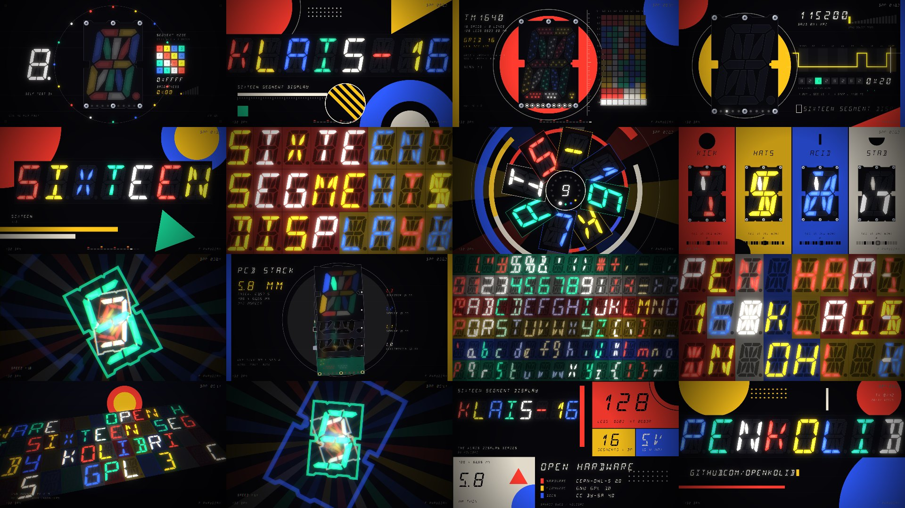

# KLAIS-16 // SIXTEEN

**A dark techno × Bauhaus music video for [openKolibri/klais-16](https://github.com/openKolibri/klais-16)** — the open-hardware
16-segment LED display. About two minutes, 1080p. The music, the picture and the encode are all generated by code in this repo;
nothing is hand-animated and nothing is sampled (except a tiny robot voice, see below).

▶ **[`dist/klais16-bauhaus.mp4`](dist/klais16-bauhaus.mp4)** — 1:58 · 1920×1080 @ 30 fps · H.264 + AAC · 47 MB · −14 LUFS



## The idea

A techno bar has **16 sixteenth-note steps**. The display has **16 segments**. So the display *is* the sequencer:
step *i* lights segment *i* (firmware order `A B C D E F G H K M N P R S T U`). Every drum and bass pattern in the track is a
16-step grid, and on screen the kick, hats, acid line and stabs each play a colourway of the product
(`SEG-16-RED / YEL / BLU / WHT-MDNT`, straight from the part-number table) segment by segment.

The look is Bauhaus: flat primaries, circles / half-discs / triangles / bars, rulers, a construction grid, type as image — on the
black MDNT face, with the product's own LED colourways (`RED YEL BLU GRN WHT`) as the palette and a little bloom because LEDs glow.

## Everything is taken from the real project

Nothing is a lookalike; the video is driven by the data in the klais-16 repo:

| On screen / in the track | Comes from |
| --- | --- |
| The 17 segment shapes, the board outline with its connector notches, six screws, mounting holes | KiCad files (`pcb/*/*.kicad_pcb`, layer `Edge.Cuts`), parsed by `tools/extract-geometry.mjs` |
| All **128 LEDs at their true PCB positions** and which segment each belongs to | `pcb/…-L0.kicad_pcb` + `firmware/include/segmentMapping.h` (every LED lands inside the polygon of its own segment — the script checks) |
| Every glyph | the firmware's own ASCII table `firmware/include/sixteenSegments.h` (MIT, © 2017 David Madison) |
| **The daisy chain**: each byte pushes the byte a module holds on to the next module; all displays latch together after a pause | how `firmware/src/main.c` really works (RX/TX interrupts + the "timeout refresh") — the title *"KLAIS-16"* is sent in reverse so it reads correctly once shifted through 8 modules |
| **UART frames** (8N1, LSB first, 115200 baud) | README §UART; the same bitstream is the *rhythm of the blips you hear* — every `1` bit is a ping, one bit per 16th note |
| TM1640 scan: 16 grids × 8 lines, `GRID = (REF-1)/8+1`, `SEG = (REF-1)%8` | README §LED Number |
| Brightness codes `0x88…0x8F`, segment-mode `0x11 DC1 + 3 bytes`, baud-select pads | README §Firmware |
| The exploded **PCB stack** L0–L3, 5.8 mm, 63.97 g, 100 × 66.66 mm | README §Design / §PCB Stack (layer geometry from the KiCad files) |
| 128 LEDs, 16 segments, 5 V, 1.6 W, licences, part numbers | README |
| `SIXTEEN` / `SEGMENT` / `DISPLAY` — the three title words (all exactly seven letters, so they fill seven modules) | README header art |
| The "inverted" cells (letter cut out of a lit block) | a nod to the README's `Todo: implement inverted font` |

The **Kolibri bird artwork is deliberately not used**: the klais-16 README says it is a trademark that may not be reproduced in derivative works.

## The track

132 BPM, F phrygian/minor, 64 bars (+ a bar of ring-out), synthesised from scratch in plain JavaScript — no samples, no DAW
(`src/audio/`): kick with two-stage pitch glide, a reverb-tail *rumble* bass sidechained to the kick, a TB-303-style acid line
through a nonlinear ladder filter, 909-style hats, claps, polyrhythmic ticks (every 5th step), toms (every 7th), FM clanks
(every 3rd), dub-techno chord stabs into a ping-pong echo, pads, risers, an FDN reverb, bus compression and a look-ahead limiter,
mastered to −14 LUFS with a −1.5 dBFS ceiling. Layers on top:

* **The UART layer** — `KLAIS-16 SIXTEEN SEGMENT DISPLAY` as 10-bit frames, one bit per 16th note, pitched by bit position.
  `KLAIS-16` is exactly 80 bits = 5 bars.
* **The boot chirps** — in bar 1 each of the 16 sixteenth-notes plays a rising blip *as its segment lights up* (the self-test).
* **A robot voice** (eSpeak NG formant synthesis) chanting the README's title words, timed to the on-screen typing in the build and
  to the rows of the wall in the drop.

The synthesiser is deterministic (seeded noise), so every render is bit-identical. It also writes a **cue sheet**
(`build/cues.json`: every drum hit, note, blip and vocal syllable, plus a 24-band spectrum every 1/60 s) that the renderer reads —
that is how the picture is locked to the music.

## Structure

| Bars | Time | Scene | What happens |
| ---: | ---: | --- | --- |
| 0–3 | 0:00 | **boot** | one module powers up; underline LEDs, DP; the 16-segment self-test (one chirp = one segment); mask register `0x0000→0xFFFF`; brightness ladder `0x88→0x8F`; `0x81` OFF |
| 3–6 | 0:05 | **chain** | 8 modules power up, bytes shift through the chain, *timeout*, **all modules latch on the downbeat of bar 4** as the kick enters — `KLAIS-16` |
| 6–8 | 0:11 | **scan** | the 128 LEDs at their real positions + the 16×8 multiplex mosaic, one grid per 16th, double speed in the last bar |
| 8–12 | 0:15 | **ascii** | huge glyph + the live UART waveform of the byte being transmitted (the blips you hear) |
| 12–16 | 0:22 | **words** | `SIXTEEN`, `SEGMENT`, `DISPLAY` typed one letter per step (the voice says each as it lands); bar 15 is the riser, the last step a blackout |
| 16–20 | 0:29 | **wall** | drop — an 8×3 wall of modules edge to edge, letters coloured by flat Bauhaus fields |
| 20–24 | 0:36 | **kaleido** | `KLAIS-16` as a ring of glyphs snapping 22.5° per beat |
| 24–28 | 0:44 | **sequencer** | four colourways, four instruments, one segment per step |
| 28–32 | 0:51 | **tunnel** | fly through a corridor of panels; speed ramps with the riser |
| 32–40 | 0:58 | **stack** | breakdown — the four-board PCB sandwich explodes; the arpeggio chases around the segments; UART sparks race between the edge connectors; it slams shut on the snare roll |
| 40–44 | 1:13 | **table** | drop 2 — the whole printable ASCII set, 16 × 6 panels, ripples on every kick |
| 44–48 | 1:20 | **wall** | marquee + inverted cells |
| 48–52 | 1:27 | **array** | a 14 × 4 array in real perspective, swinging camera (the repo's `isoArray` photo, alive) |
| 52–56 | 1:34 | **tunnel** | faster, twisted the other way |
| 56–60 | 1:42 | **poster** | the spec sheet as a Mondrian/Bauhaus poster |
| 60–64 | 1:49 | **url** | the URL pushed through the chain one byte per eighth note; the last 8 characters are, of course, `KLAIS-16` |
| 64 | 1:56 | **end** | the array holds `KLAIS-16.`, the decimal points blink, power down |

Between scenes there are Bauhaus wipes (slabs, iris, checkerboard, bars); the big impacts (bars 8, 16, 40, 56) are hard cuts with a shockwave ring.

## Run it yourself

Requirements: Node ≥ 20.12, [Playwright](https://playwright.dev) (`npm install` — uses headless Chromium), and an `ffmpeg` with libx264 + AAC
(`FFMPEG=/path/to/ffmpeg` to override). Optional: eSpeak NG only if you want to regenerate the voice samples.

```sh
npm install
KLAIS16=/path/to/klais-16 npm run geometry   # optional: re-extract geometry + font (the JSON is committed)
npm run audio                                # synthesize build/track.wav + build/cues.json (~20 s) and print QA numbers
npm run render                               # render 1080p30 -> dist/klais16-bauhaus.mp4 (~5 min on 4 cores)
npm run flash-check                          # photosensitivity guard rail on the finished video
npm run sync-check                           # measures picture-vs-music timing in the finished video
```

Options for `render`: `--fps 60`, `--workers 4`, `--crf 21`, `--preset slow`, `--start 30 --end 60` (seconds, for quick tests).
Every frame is a pure function of time, so frames render independently, in parallel, in any order.

**Live preview** (60 fps, with audio): `npm run audio && npm run preview`, then open <http://localhost:8080/src/render/index.html>.

Handy while developing: `npm run still -- b16.4 b30.10` (single frames; `bBAR.STEP` or seconds) and `npm run sheet` (contact sheet of the whole video).

## A note on flashing

The video is designed to avoid strobing: kicks pulse the picture by a few percent, not the brightness of the whole frame. The biggest luminance
changes are the scene wipes (roughly every 7 s) and a handful of brief accents (the latch on bar 4, the slam at the end of the breakdown, the shockwave
rings on the drops). `tools/flash-check.mjs` decodes the finished file and counts large-area luminance swings per second (whole frame and quadrants);
on the released video the worst one-second window has a single flash against a limit of three. It is a guard rail, not a certification.

## Layout

```
src/audio/     synth engine (dsp.mjs), instruments (voices.mjs), the composition (song.mjs), mix + master (render-audio.mjs), voice samples
src/render/    Canvas2D renderer: glyph engine, Bauhaus primitives, post fx, one file per scene in scenes/, timeline + transitions
src/geometry/  klais16.json (segments, LEDs, outline, parts) and font16.json (16-segment ASCII table), extracted from the klais-16 repo
tools/         extractors, still/sheet/render/serve, audio and flash QA, voice generator
dist/          the finished video
```

## Credits and licences

This project is a derivative of [openKolibri/klais-16](https://github.com/openKolibri/klais-16) (designed by Sawaiz Syed for Kolibri) and
follows its licensing: the copies of all licences are in [`LICENSES/`](LICENSES/).

| Part | Licence |
| --- | --- |
| Code (`src/`, `tools/`) | GPL-3.0-or-later (like the klais-16 firmware) |
| `src/geometry/klais16.json` — derived from the KiCad hardware sources | CERN-OHL-S-2.0 |
| The 16-segment ASCII table in `src/geometry/font16.json` | MIT, © 2017 David Madison — [LED-Segment-ASCII](https://github.com/dmadison/LED-Segment-ASCII) |
| The video and audio, and the facts taken from the klais-16 README | CC BY-SA 4.0 |
| Voice samples (`src/audio/samples/`) | output of [eSpeak NG](https://github.com/espeak-ng/espeak-ng) (GPL-3.0-or-later) |

The Kolibri bird logo is a trademark of Kolibri and is not reproduced here. These licence choices are a starting point that follows the upstream
project — the repository owner is free to change them.
